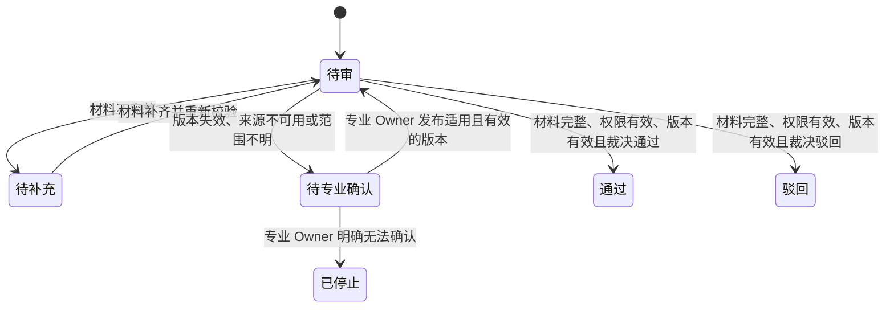

# 外部资质审核产品设计

- 当前版本：1.1；文档状态：评审中；更新时间：2026-09-09 +08:00。
- 产品 owner：资质审核产品负责人；业务 owner：资质运营负责人。
- 文档强度：增强；依据：涉及外部版本规则、专业确认、不可错误放行和跨角色人工承接；权威来源：本文件，外部规则以专业 Owner 确认的版本记录为准。

资料性质：合成契约样例，不是实际外部政策、用户阅读证据或专业批准。宽表样例仅用于历史评测回放及裁决规则对照；当前终态与通知口径以本样例为准，不沿用旧样例中的冲突表述。

## 产品摘要

本产品面向申请方、审核员和资质专业 Owner，提供可追溯的资质审核与人工承接，解决外部规则版本不一致造成的错误放行和责任不清，让申请方知道当前状态及后续由谁处理。

- 本期范围：覆盖资质申请、规则版本、审核结论和人工确认，不提供监管解释、历史结论重算或通用规则平台。
- 核心链路：平台校验材料、权限和版本；条件满足后由审核员形成通过或驳回，平台保存有效版本和审计事实，运营通知申请方。
- 异常与边界：材料不足转待补充，版本失效或不明转待专业确认；专业 Owner 明确无法确认则停止。通知失败由运营重试，不回退审核状态；人工接管不能代替有效版本。
- 关键待确认：Q-001 中的外部来源、生效范围和最终版本仍由资质专业 Owner 确认；缺少有效版本时不得形成通过或驳回结论。

## 一、背景与问题

不同运营人员使用的外部资质规则版本不一致，申请方无法知道结论依据，专业人员也无法复核历史裁决。当前问题是版本事实缺失和失效后的责任不清，不是缺少一个自动审批按钮。事实来源为合成评测场景，产品和资质运营确认场景输入；外部规则有效性仍由专业 Owner 确认。

## 二、目标与非目标

业务目标是让每个审核结论可追溯到有效规则版本，用户目标是明确申请状态和继续处理的责任方。非目标是不解释外部政策、不替代专业 Owner。成功指标：缺少规则版本的结论比例按“未保存有效版本引用的通过或驳回结论数 / 全部通过或驳回结论数”计算；当前基线为上线前连续 30 天审核审计记录中的 12%，上线 30 天内目标降至 0%，观察窗口为上线后连续 30 天，Owner 为资质运营负责人。此处数值仅为合成样例输入。

## 三、定性与范围

定性对象：业务流程。
本期变化：风险约束。
责任边界：平台执行已确认规则并保存事实，资质专业 Owner 解释和确认外部规则，运营承接待确认申请。

范围包括资质申请、规则版本、审核结论和人工确认，不覆盖监管解释、历史结论重算或通用规则平台。申请与规则版本分离；通过或驳回结论必须引用有效版本，待补充、待专业确认和已停止均不等于审核结论。总体判断是先固定有效版本和失效承接，不建设规则编辑器。

## 四、概要设计

方案概述：平台先校验规则版本，再让审核员依据有效版本形成结论；无法确认版本时进入专业确认。

产品架构主脊：降低错误放行风险 -> SCN-001 / SCN-002 -> 版本裁决 / 专业确认 -> 申请和规则版本状态 -> R-EXT-001 -> 可追踪结论。

核心能力：申请受理、版本选择、规则裁决、待专业确认、通知和审计查询。核心对象与关系：资质申请处于待审、待补充、待专业确认、通过、驳回或已停止之一；规则版本处于有效、失效或待确认之一；只有通过或驳回结论保存有效版本引用。

核心概念：待专业确认；定义：规则适用性尚未被专业 Owner 确认的申请状态；不是什么：审核通过；归属主体：平台。

关键交互与边界：审核员只裁决材料完整且版本有效的申请，平台阻止无有效版本形成通过或驳回，专业 Owner 确认规则，运营承接升级和通知。产品视图：下方状态机说明申请状态及其与规则版本的迁移约束，规则版本自身状态由专业 Owner 的版本记录持有。

## 五、详细设计

场景关系：分支。材料完整且有有效版本才进入 SCN-001，材料不足先进入待补充，版本失效或不明时进入 SCN-002。

### 申请状态机

通过、驳回和已停止是终态，不得回到待审；待专业确认期间不得形成通过或驳回。已停止不以通知送达为前提，通知失败不回退审核状态，运营承接重试；本轮通知收口条件见 SCN-002。迁移条件以 R-EXT-001 和对应场景为准，图不新增独立规则。

### SCN-001 使用有效版本审核

- 业务情境：审核员处理待审申请，平台已取得适用且有效的规则版本，需要形成可追踪结论。
- 责任推进：平台展示版本和材料，审核员裁决，平台保存结论、版本、操作者和时间，运营通知申请方。
- 裁决与状态：依据 R-EXT-001，申请由待审变为通过或驳回；结论必须引用本次有效版本。
- 异常与收口：材料不足时进入待补充且不形成审核结论；材料补齐并重新校验后回到待审。结论和版本引用可查询，且通知送达，或通知失败已留痕并由运营接管重试，才完成本轮收口。

### SCN-002 规则失效转专业确认

- 业务情境：审核员处理待审申请，但规则版本已失效、来源不可用或适用范围无法确认。
- 责任推进：平台停止自动裁决并把申请交给资质专业 Owner；运营告知申请方当前仍在处理中。
- 裁决与状态：依据 R-EXT-001，申请进入待专业确认，不得形成通过或驳回结论；专业 Owner 发布适用且有效的版本后，申请才能回到待审并重新进入审核。
- 异常与收口：人工 SLA 从进入待专业确认时起算，资质专业 Owner 应在 4 个工作小时内接单，并在 8 个工作小时内发布适用且有效的版本或明确无法确认；4 小时未接单时告警资质运营负责人，8 小时无结论时保持待专业确认并升级，不得自动形成审核结论。专业 Owner 明确无法确认时即进入已停止；通知送达，或通知失败已留痕并由运营接管重试，才完成本轮收口。通知重试不回退已停止状态。

### 跨场景端到端流程与图形视图

1. 平台受理申请并校验材料、权限和候选规则版本；材料不足时进入待补充，不形成审核结论。
2. 材料完整、权限有效且版本有效时进入 SCN-001，由审核员裁决并保存版本引用。
3. 版本失效、来源不可用或范围不明时进入 SCN-002，申请转待专业确认。
4. 专业 Owner 发布适用且有效的版本后，平台记录版本事实并让申请回到待审；材料未变化且仍在有效期内可以沿用，否则转待补充。专业 Owner 明确无法确认时即进入已停止，再通知申请方；通知失败按 SCN-002 承接，不回退审核状态。

### 产品需求陈述

需求名称：保存裁决版本；需求类型：功能。

在 SCN-001 / 申请待审、材料完整、权限有效且版本有效时，资质审核平台必须为每个通过或驳回结论保存本次有效裁决版本。
需求边界：只有有效版本才能形成通过或驳回结论。

- 来源与可靠性：合成评测规则，已确认；关联规则：R-EXT-001。
- 验收样例：结论可查询有效版本引用。

需求名称：阻止无版本结论；需求类型：约束。

在 SCN-002 / 版本失效、来源不可用或范围待确认时，资质审核平台不得形成通过或驳回结论。
需求边界：等待、恢复与停止分别按 SCN-002 执行，不因通知失败推迟或回退已停止。

- 来源与可靠性：合成评测规则，已确认；关联规则：R-EXT-001。
- 验收样例：无有效版本不产生通过或驳回；未答时保持待专业确认并升级，专业 Owner 明确无法确认则立即进入已停止；专业 Owner 发布适用且有效的版本后回到待审，材料复核和通知收口按 SCN-002 执行。

## 六、业务规则

两个场景共用版本裁决规则。

### R-EXT-001 外部资质版本裁决

规则名称：外部资质版本裁决；规则性质：版本化 / 外部规则；业务动机：防止无有效版本形成结论。

适用场景 / 步骤：SCN-001 / SCN-002 / 版本校验；输入事实：申请材料、审核权限、版本状态和适用范围。

- 当：材料完整、权限有效且版本有效；
  则：允许形成通过或驳回。
- 当：材料不完整；
  则：转待补充且不形成结论。
- 当：版本失效或不明；
  则：转待专业确认且不形成结论。

Owner：资质专业 Owner。

- 正例：有效版本可裁决。
- 边界例：材料不足转待补充。
- 反例：无有效版本不得形成通过或驳回。

来源：合成外部规则索引；版本：2026.1-candidate；生效期：2026-09-01 起，待专业确认；未确认前处理：保持待专业确认，不形成通过或驳回结论。

## 七、数据、权限、风险与待确认

数据记录申请状态、结论、版本引用、操作者、状态时间、专业接单时间、版本确认时间、告警和通知结果，不记录外部规则全文。审核员只能裁决材料完整、权限有效且版本有效的待审申请；专业 Owner 可以发布版本事实；运营只能查询、升级和重试通知。人工处理时限与超时升级以 SCN-002 为准，不另维护一组 SLA。

### Q-001 外部版本事实待确认

当前判断：失效转专业确认的处理路径已确认，外部来源、生效范围和最终版本仍为 PENDING，不能按“部分已确认”关闭整项。

影响：缺少有效版本会阻断通过或驳回。确认方：资质专业 Owner。未确认前处理：评审结束前未确认则保持待专业确认且不得形成通过或驳回；人工承接与恢复按 SCN-002 执行，不代表专业批准或生产准出。

## 八、验收摘要

对应场景：SCN-001、SCN-002。

正常结果：材料完整、权限有效且版本有效时形成通过或驳回，结论、有效版本引用、操作者和时间可查询。边界结果：材料不足转待补充；版本到期、来源不可用或范围不明转待专业确认；两种状态都不产生审核结论。禁止结果：无有效版本不得形成通过或驳回，待专业确认不得跳过待审直接形成通过或驳回结论。

失败后的可观察状态：待专业确认显示承接 Owner、进入时间和 SLA 截止；通知失败保留审核状态、失败记录和运营重试任务。恢复或人工处理：专业 Owner 发布适用且有效的版本后，申请回到待审；材料仍有效则沿用，否则进入待补充；专业 Owner 明确无法确认则进入已停止，通知收口按 SCN-002 执行，通知失败不得延迟或回退已停止状态。

数据、审计或运营证据：版本引用、操作者、状态时间、专业接单、告警、通知结果和重试任务可查询。验收 Owner：产品、运营和资质专业 Owner。

### 产品到架构交接

权威输入：本文件 v1.1，第五节场景、第六节规则、本节验收摘要。不得自行补定：Q-001 所列外部版本事实及其开放条件。

承接位置：系分与执行计划尚未建立，由产品 Owner 在进入工程交接前指定；本合成样例不建立空文档或虚构链接，交接说明不再抄写产品定义。
